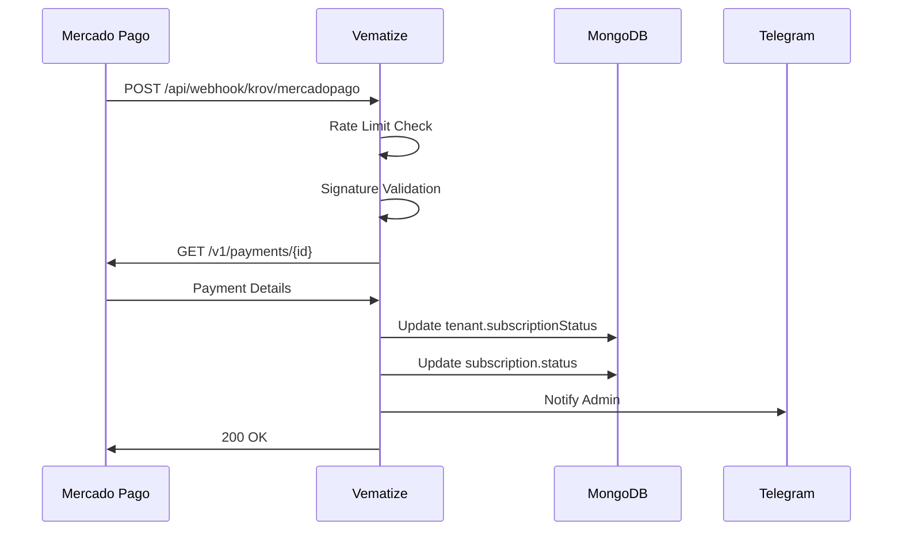
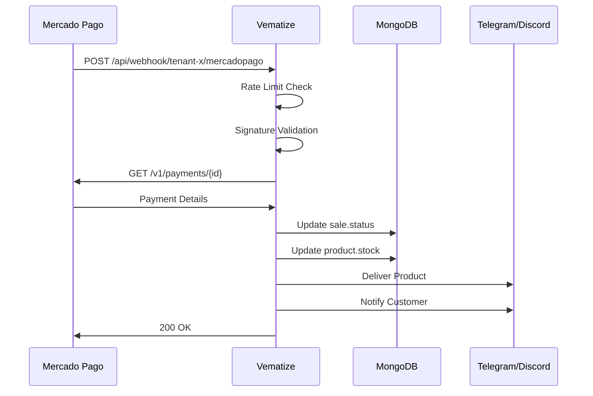

# 📡 Arquitetura de Webhooks - Vematize

## 🎯 Visão Geral

O sistema possui **dois tipos de webhooks** com propósitos distintos:

```
┌──────────────────────────────────────────────────────────────┐
│                    WEBHOOKS VEMATIZE                         │
└──────────────────────────────────────────────────────────────┘
                          │
        ┌─────────────────┴─────────────────┐
        ↓                                   ↓
┌───────────────────┐          ┌────────────────────┐
│  KROV WEBHOOKS    │          │  TENANT WEBHOOKS   │
│  (Admin/SaaS)     │          │  (Clientes)        │
└───────────────────┘          └────────────────────┘
        ↓                                   ↓
┌───────────────────┐          ┌────────────────────┐
│ Pagamentos de     │          │ Pagamentos de      │
│ Assinatura        │          │ Produtos do Bot    │
│ (mensalidade)     │          │ (vendas do tenant) │
└───────────────────┘          └────────────────────┘
```

---

## 🏢 1. Krov Webhooks (Admin)

### Propósito
Processar **pagamentos de assinatura** da plataforma Vematize (mensalidades dos tenants).

### Endpoint
```
POST https://seudominio.com/api/webhook/krov/[gateway]
```

### Parâmetros
- `[gateway]`: `mercadopago` ou `sandmercadopago`

### Exemplos de URL
```bash
# Produção
https://vematize.com/api/webhook/krov/mercadopago

# Sandbox
https://vematize.com/api/webhook/krov/sandmercadopago
```

### Configuração no Mercado Pago
```
Painel Krov → Configurações → Mercado Pago → Webhook URL
URL: https://seudominio.com/api/webhook/krov/mercadopago
```

### O que Processa
- ✅ Pagamentos de renovação de plano
- ✅ Upgrade/downgrade de plano
- ✅ Ativação de cupons de desconto
- ✅ Atualização de `subscriptionStatus` do tenant
- ✅ Extensão de `trialEndsAt`

### Collection MongoDB
```javascript
// Atualiza: tenants (subscriptionStatus, planId)
// Atualiza: subscriptions (status, paidAt)
```

---

## 👥 2. Tenant Webhooks (Clientes)

### Propósito
Processar **vendas de produtos** de cada cliente (bot sales).

### Endpoint
```
POST https://seudominio.com/api/webhook/[subdomain]/[gateway]
```

### Parâmetros
- `[subdomain]`: Subdomínio do tenant (ex: `loja-exemplo`)
- `[gateway]`: `mercadopago` ou `sandmercadopago`

### Exemplos de URL
```bash
# Cliente "loja-exemplo" - Produção
https://vematize.com/api/webhook/loja-exemplo/mercadopago

# Cliente "tech-store" - Sandbox
https://vematize.com/api/webhook/tech-store/sandmercadopago
```

### Configuração
```
Painel Cliente → Configurações → Mercado Pago → Webhook URL
URL: https://seudominio.com/api/webhook/{seu-subdomain}/mercadopago
```

### O que Processa
- ✅ Vendas de produtos (files, activation codes)
- ✅ Entrega automática via bot (Telegram/Discord)
- ✅ Atualização de estoque
- ✅ Notificação ao cliente
- ✅ Registro de venda na dashboard

### Collection MongoDB
```javascript
// Atualiza: sales (status, deliveredAt)
// Atualiza: products (estoque se for activation code)
// Cria: notification via Telegram/Discord bot
```

---

## 🔒 Segurança dos Webhooks

### Implementado ✅

#### 1. **Rate Limiting**
```typescript
// 1 requisição por segundo, burst de 3
checkRateLimit(rateLimitKey, {
  requestsPerSecond: 1,
  burstLimit: 3,
  windowMs: 1000,
});
```

#### 2. **Payload Size Limit**
```typescript
// Máximo 1MB
validatePayloadSize(contentLength, 1048576);
```

#### 3. **Webhook Signature Verification**
```typescript
// Valida assinatura do Mercado Pago
if (secret && signatureHeader) {
  isValidSignature(signatureHeader, secret, requestId, searchParams);
}
```

#### 4. **Double Verification com Provider**
```typescript
// Sempre busca status direto no Mercado Pago
const mpPayment = await payment.get({ id: paymentId });
```

#### 5. **Untrusted Webhook Alerting**
```typescript
// Marca tenant como untrusted se não tiver secret
await checkAndMarkUntrustedWebhook(tenant, hasSecret);
```

---

## 📋 Estrutura de Arquivos

```
src/app/
├── api/webhook/krov/[gateway]/
│   └── route.ts              → Krov webhooks (assinaturas)
│
└── [subdomain]/api/webhook/[gateway]/
    └── route.ts              → Tenant webhooks (produtos)
```

---

## 🔧 Proposta: Webhook Unificado (Futuro)

### Estrutura Sugerida
```
src/app/api/webhook/[type]/[identifier]/[gateway]/route.ts
```

### Exemplos
```bash
# Krov (admin)
POST /api/webhook/admin/krov/mercadopago

# Tenant
POST /api/webhook/tenant/loja-exemplo/mercadopago
```

### Benefícios
- ✅ Lógica centralizada
- ✅ Mais fácil de manter
- ✅ Rate limiting compartilhado
- ✅ Segurança unificada
- ✅ Logs centralizados

### Implementação
```typescript
// src/app/api/webhook/[type]/[identifier]/[gateway]/route.ts
export async function POST(request, { params }) {
  const { type, identifier, gateway } = params;
  
  if (type === 'admin') {
    return handleKrovWebhook(identifier, gateway, request);
  }
  
  if (type === 'tenant') {
    return handleTenantWebhook(identifier, gateway, request);
  }
}
```

---

## 🧪 Como Testar

### 1. Testar Krov Webhook (Assinatura)
```bash
curl -X POST https://localhost:3000/api/webhook/krov/sandmercadopago \
  -H "Content-Type: application/json" \
  -d '{
    "type": "payment",
    "data": { "id": "123456789" }
  }'
```

### 2. Testar Tenant Webhook (Produto)
```bash
curl -X POST https://localhost:3000/api/webhook/meu-tenant/sandmercadopago \
  -H "Content-Type: application/json" \
  -d '{
    "type": "payment",
    "data": { "id": "987654321" }
  }'
```

---

## 📊 Fluxo Completo

### Krov Webhook (Assinatura)


### Tenant Webhook (Produto)


---

## 🚨 Alertas e Monitoramento

### Logs Importantes
```typescript
// Webhook sem secret (CRÍTICO)
console.warn(`🚨 UNTRUSTED WEBHOOK: No webhook secret for ${gateway} on ${subdomain}`);

// Rate limit excedido
console.warn(`[Webhook Security] Rate limit exceeded for ${subdomain}/${gateway}`);

// Payload muito grande
console.error(`[Webhook Security] Payload too large. Size: ${contentLength}`);

// Assinatura inválida
console.error(`[MP Webhook] Invalid signature for ${subdomain}`);
```

### Collection de Alertas
```javascript
// MongoDB: webhook_security_alerts
{
  tenantId: "...",
  subdomain: "loja-exemplo",
  alertType: "untrusted_webhook_payment",
  severity: "critical",
  details: {
    saleId: "...",
    paymentId: "...",
    amount: 99.90,
    webhookVerified: false,
    providerVerified: true
  },
  timestamp: ISODate("2025-10-07T...")
}
```

---

## 📚 Referências

- [Mercado Pago Webhooks](https://www.mercadopago.com.br/developers/pt/docs/your-integrations/notifications/webhooks)
- [Webhook Signature Validation](https://www.mercadopago.com.br/developers/pt/docs/your-integrations/notifications/webhooks#bookmark_assinatura_da_notificação)
- Código: `src/lib/webhook-security.ts`
- Código: `src/lib/webhook-rate-limiter.ts`

---

**Última atualização**: 07/10/2025  
**Autor**: Vematize Team

